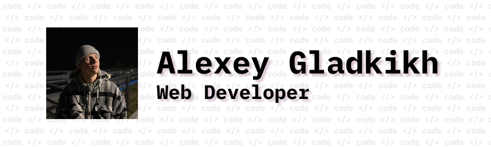

# Junior Web Developer. Junior JavaScript engineer.

**👋 Welcome there, my name is Alexey Gladkikh. <br>
I am independently studying modern web development tools.**


<p>
     
    I'm from Perm, Russia
</p>
<p>
     
    Started my own path in WEB in 2026
</p>
<p>
    
    More than 2 year of freelance/individual-entrepreneur Backend experience
</p>
<p>
     
    Currently based in St. Petersburg, Russia
</p>

___

### Languages and Tools


*Soft Skills:*

```
- Time management
- Teamwork
- English language (A2) 
- Ease-going, 
- Aspiration to self-developing
```

***And I'm really interested in enhancing that list***

___

**Web application development and reviewing for you** <br>
⚠️ Price depends on <u>project size</u>

### Follow me
[](mailto:babyhackcode@gmail.com)
[](https://t.me/sokissmeplease)


